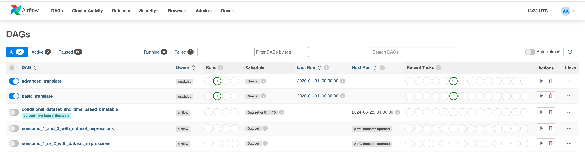
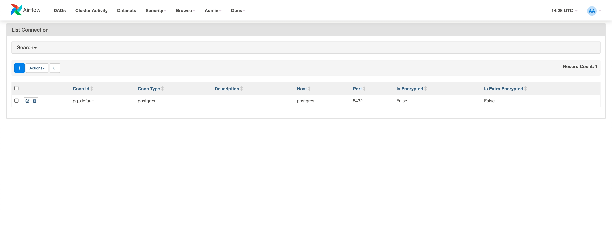
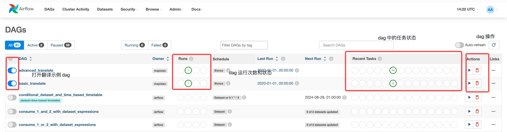

# 翻译工作流系统

## 背景

本系统基于 [Apache Airflow](https://airflow.apache.org/) 开发，用于翻译工作流的管理。调度框架和工作流管理使用 Airflow 已有的功能，额外添加翻译需要的各种算子和数据存储，使得译者可以灵活的使用各种方法和流程来进行翻译

插件开发参考 [Airflow 插件开发文档](https://airflow.apache.org/docs/apache-airflow/stable/authoring-and-scheduling/plugins.html#plugins)

## 项目结构

插件相关源代码在 plugins 目录中
+ data 为数据相关的代码，包括数据库、数据存储、数据处理等
+ operators 为算子相关的代码，包括各种新增算子
+ utils 为工具相关的代码，目前为机器翻译引擎和大模型 LLM 的调用工具
+ tests 为测试相关的代码，目前为单元测试

dags 目录为示例的 dag 文件，打开 airflow 后可以直接开启

相关的设计文档在 docs 目录中
+ [数据库设计](./docs/database.md) 包含了各种数据结构的字段和数据库类型
+ [存储系统设计](./docs/storage.md) 描述了存储系统的设计和各种概念
+ [算子功能](./docs/operators.md) 描述了算子的功能

## 开发步骤

本系统的开发基于 docker-compose，操作流程参考 [Airflow 文档](https://airflow.apache.org/docs/apache-airflow/stable/howto/docker-compose/index.html)。在其原有的 docker 文件上构建了翻译系统所需的镜像和服务，因此使用时直接使用项目中的 docker-compose.yaml 即可

初次使用步骤，后续可以参考 Airflow 文档
```bash
1. git clone 
2. cd 
3. echo -e "AIRFLOW_UID=$(id -u)" > .env
4. docker compose up airflow-init
```

初次使用 `docker compose up` 并连接到 UI 界面时如下


此时会发现已有 dag 的导入错误，此时需要添加连接 `Admin-Connections`，如下图所示


之后就可以开始使用 airflow，可以运行 airflow 的任务，操作如下
